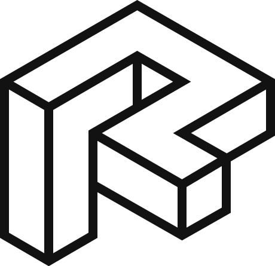

Revitron
========

.. container:: .large
	
   The Revitron library can be installed as a single Python package for `pyRevit <#>`_ or bundled with a custom fork of pyRevit including the Jarvis package manager und the Revitron UI.

.. container:: .buttons

   `Docs <installing.html>`_
   `GitHub <installing.html>`_

.. toctree::
   :caption: Theme Documentation
   :maxdepth: 2
   :hidden:

   installing
   configuring
   contributing

.. toctree::
   :maxdepth: 1
   :hidden:

   changelog

.. toctree::
    :maxdepth: 2
    :hidden:
    :numbered:
    :caption: Demo Documentation

    demo/structure
    demo/demo
    demo/lists_tables
    demo/api

.. toctree::
    :maxdepth: 3
    :hidden:
    :numbered:
    :caption: This is an incredibly long caption for a long menu

    demo/long